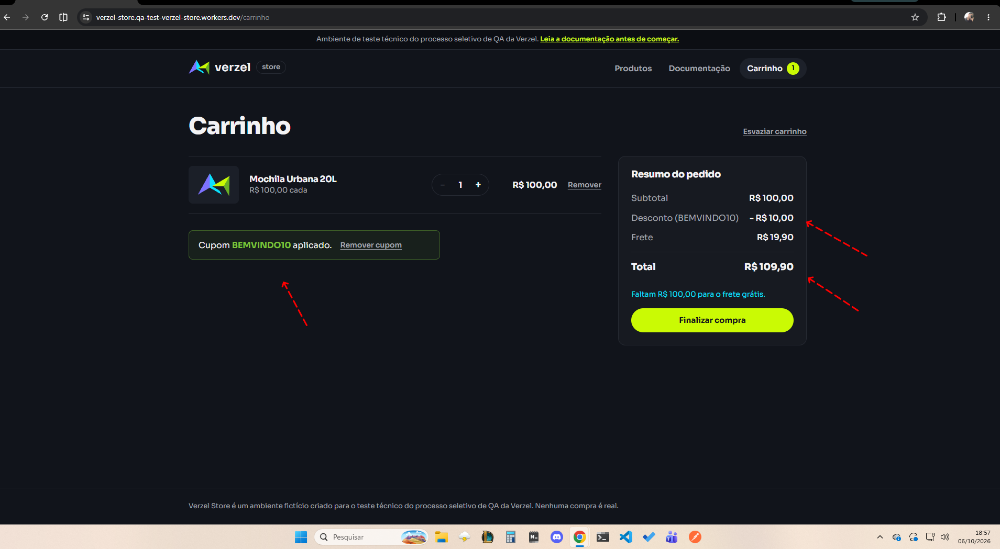
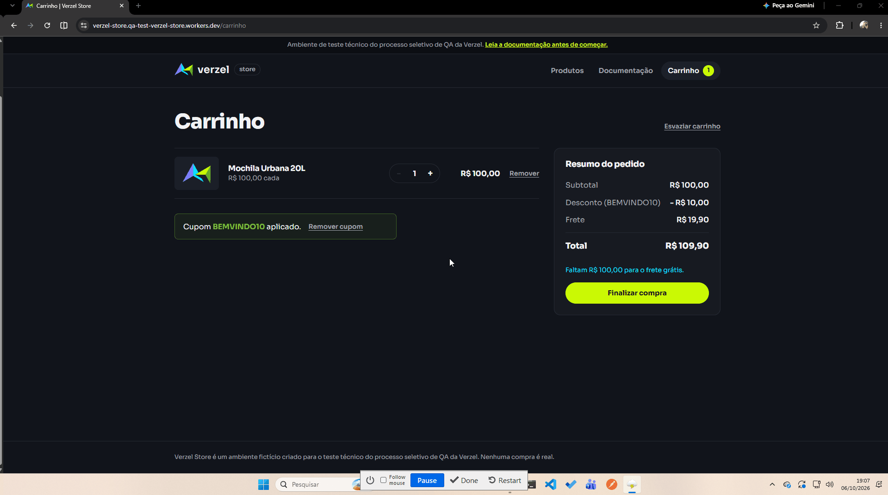
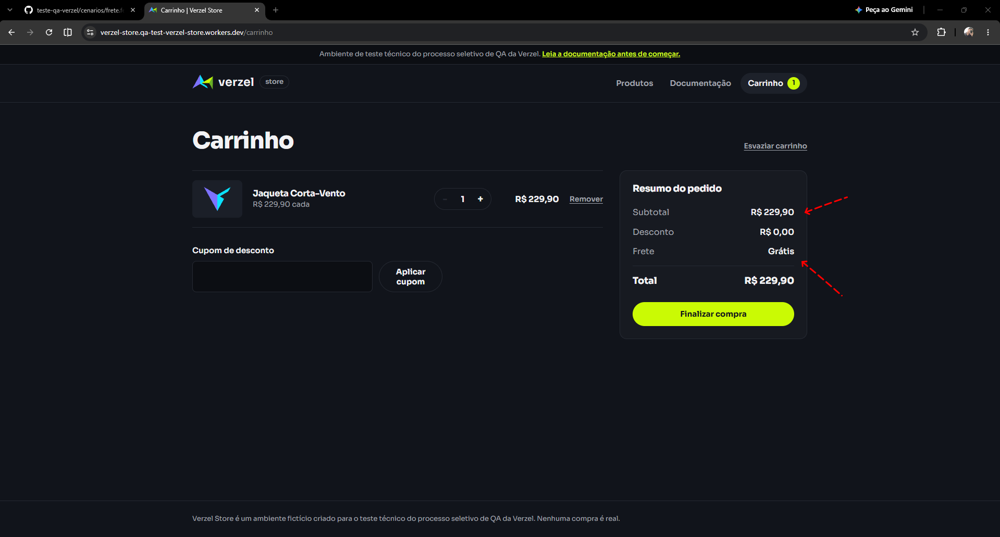
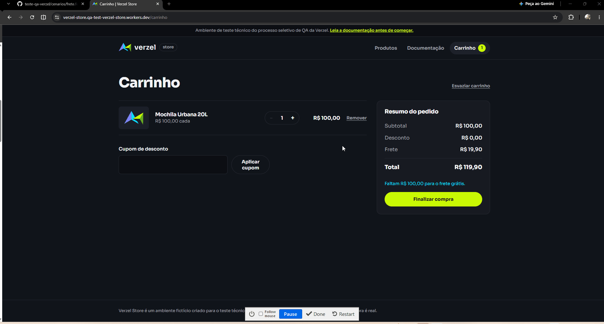
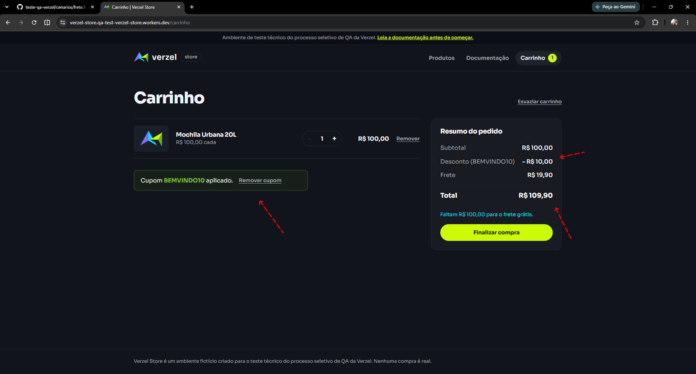

# 📸 Relatório de Execução e Evidências de Testes - Verzel Store

## 🎟️ Regra de Cupons de Desconto (Card VZS-142)

---

### 🔹 Cenário 1: Aplicação de cupom válido com sucesso

**BDD / Gherkin:**
- Dado que o subtotal do carrinho é de R$ 100,00
- Quando o cliente aplica o cupom "BEMVINDO10"
- Então deve ser concedido 10% de desconto sobre o subtotal
- E o valor do desconto deve ser R$ 10,00

* **Resultado:** Sucesso ✅

<details>
<summary><b>🔍 Clique aqui para expandir a evidência do Cenário 1</b></summary>



</details>

---

### 🔹 Cenário 2: Aplicação de cupom com letras minúsculas e espaços

**BDD / Gherkin:**
- Dado que o subtotal do carrinho é de R$ 100,00
- Quando o cliente digita o cupom " bemvindo10 "
- Então o cupom deve ser aceito e aplicar 10% de desconto

* **Resultado:** Sucesso ✅

<details>
<summary><b>🔍 Clique aqui para expandir a evidência do Cenário 2</b></summary>


</details>

---

### 🔹 Cenário 3: Tentativa de aplicação de cupom inexistente

**BDD / Gherkin:**
- Quando o cliente tenta aplicar o cupom "CUPOMINEXISTENTE"
- Então nenhuma porcentagem de desconto deve ser aplicada
- E a mensagem "Cupom inválido." deve ser exibida

* **Resultado:** Sucesso ✅

<details>
<summary><b>🔍 Clique aqui para expandir a evidência do Cenário 3</b></summary>


</details>

---

### 🔹 Cenário 4: Tentativa de aplicação de cupom expirado

**BDD / Gherkin:**
- Quando o cliente tenta aplicar o cupom "VERAO2026"
- Então nenhuma porcentagem de desconto deve ser aplicada
- E a mensagem "Cupom expirado." deve ser exibida

* **Resultado:** Sucesso ✅

<details>
<summary><b>🔍 Clique aqui para expandir a evidência do Cenário 4</b></summary>


</details>

---

### 🔹 Cenário 5: Remoção do cupom aplicado no carrinho

**BDD / Gherkin:**
- Dado que o cupom "BEMVINDO10" está aplicado no carrinho
- Quando o cliente clica no botão "Remover cupom"
- Então o cupom deve ser removido
- E o valor total deve ser recalculado sem o desconto

* **Resultado:** Sucesso ✅

<details>
<summary><b>🔍 Clique aqui para expandir a evidência do Cenário 5</b></summary>



</details>

---


### 🔹 Cenário 6: Cálculo de frete para compras abaixo de R$ 200,00

**BDD / Gherkin:**
- Dado que o subtotal do carrinho é inferior a R$ 200,00
- Quando o valor do frete é calculado
- Então o valor do frete deve ser cobrado normalmente

* **Resultado:** Sucesso ✅

<details>
<summary><b>🔍 Clique aqui para expandir a evidência do Cenário 6</b></summary>



</details>

---

### 🔹 Cenário 7: Validação da regra de frete grátis para compras de valor igual ou superior a R$ 200,00

**BDD / Gherkin:**
- Dado que o subtotal do carrinho atinge exatamente R$ 200,00 (2 itens de R$ 100,00)
- Quando o valor do frete é calculado
- Então o valor do frete deve ser R$ 0,00 (Grátis) conforme a regra de valor igual ou superior a R$ 200,00

* **Resultado:** Falha ❌ (Bug de Valor Limite - O sistema cobra frete com subtotal de R$ 200,00)

<details>
<summary><b>🔍 Clique aqui para expandir a evidência do Cenário 7</b></summary>



</details>

---

### 🔹 Cenário 8: Incidência do cupom de desconto exclusivamente sobre o valor dos produtos

**BDD / Gherkin:**
- Dado que o carrinho contém um produto de R$ 100,00 e o frete é R$ 19,90
- Quando o cliente aplica o cupom de 10% "BEMVINDO10"
- Então o desconto de R$ 10,00 deve incidir apenas sobre os R$ 100,00 do produto
- E o valor do frete deve permanecer em R$ 19,90
- E o total recalculado deve ser R$ 109,90

* **Resultado:** Sucesso ✅

<details>
<summary><b>🔍 Clique aqui para expandir a evidência do Cenário 8</b></summary>



</details>

---

## 🧪 Execução de Testes de API (Postman)

### **Cenário 09: Validação do Limite de Unidades por Produto**
- **Endpoint:** `POST /api/carrinho/calcular`
- **Objetivo:** Validar o comportamento da API ao solicitar a quantidade máxima permitida (6 unidades) de um item.
- **Payload Enviado:**
  ```json
  {
    "itens": [
      {
        "produtoId": "P001",
        "quantidade": 6
      }
    ]
  }

* **Status Code:** `200 OK`
* **Resultado:** Sucesso ✅
* **Resposta da API:**

  ```json
  {
    "itens": [
      {
        "produtoId": "P001",
        "nome": "Camiseta Essencial",
        "precoUnitario": 59.9,
        "quantidade": 6,
        "total": 359.4
      }
    ],
    "subtotal": 359.4,
    "desconto": 0,
    "frete": 0,
    "freteGratis": true,
    "valorFaltanteFreteGratis": 0,
    "total": 359.4,
    "cupom": null
  }
### **Cenário 10: Confirmação de Pedido com Sucesso**
* **Endpoint:** `POST /api/pedidos`
* **Objetivo:** Criar e confirmar um novo pedido enviando os dados válidos do cliente e os itens do carrinho.
* **Payload Enviado:**
```json
{
  "cliente": {
    "nome": "Talison Brito",
    "email": "talison@email.com",
    "cep": "60000000"
  },
  "itens": [
    {
      "produtoId": "P001",
      "quantidade": 1
    }
  ]
}
```
* **Status Code:** `201 Created`
* **Resultado:** Sucesso ✅
* **Resposta da API:**
  ```json

  {
    "mensagem": "Pedido criado com sucesso.",
    "pedido": {
      "numero": "VZ-155656",
      "status": "CONFIRMADO",
      "cliente": {
        "nome": "Talison Brito",
        "email": "talison@email.com",
        "cep": "60000000"
      },
      "itens": [
        {
          "produtoId": "P001",
          "nome": "Camiseta Essencial",
          "quantidade": 1,
          "precoUnitario": 59.9,
          "total": 59.9
        }
      ],
      "subtotal": 59.9,
      "desconto": 0,
      "frete": 19.9,
      "total": 79.8,
      "cupom": null
    }
  }

### **Cenário 11: Aplicação de Cupom Válido no Carrinho**
* **Endpoint:** `POST /api/carrinho/calcular`
* **Objetivo:** Garantir que o cupom `BEMVINDO10` aplica corretamente os 10% de desconto sobre o valor dos produtos.
* **Payload Enviado:**
```json
{
  "itens": [
    {
      "produtoId": "P001",
      "quantidade": 1
    }
  ],
  "cupom": "BEMVINDO10"
}
```
* **Status Code:** `200 OK`
* **Resultado:** Sucesso ✅
* **Resposta da API:**

  ```json
  {
    "itens": [
      {
        "produtoId": "P001",
        "nome": "Camiseta Essencial",
        "precoUnitario": 59.9,
        "quantidade": 1,
        "total": 59.9
      }
    ],
    "subtotal": 59.9,
    "desconto": 5.99,
    "frete": 19.9,
    "freteGratis": false,
    "valorFaltanteFreteGratis": 140.1,
    "total": 73.81,
    "cupom": {
      "codigo": "BEMVINDO10",
      "aplicado": true
    }
  }

### **Cenário 12: Tentativa de Confirmação de Pedido com Cupom Expirado**
* Endpoint: `POST /api/pedidos`
* Objetivo: Validar o bloqueio de criação de pedido ao utilizar um cupom expirado (`VERAO2026`).
* Payload Enviado:
```json
{
  "cliente": {
    "nome": "Talison Brito",
    "email": "talison@email.com",
    "cep": "60000000"
  },
  "itens": [
    {
      "produtoId": "P001",
      "quantidade": 1
    }
  ],
  "cupom": "VERAO2026"
}
```
* **Status Code:** `422 Unprocessable Entity`
* **Resultado:** Sucesso ✅
* **Resposta da API:**
```json
  {
    "erro": {
      "codigo": "CUPOM_EXPIRADO",
      "mensagem": "Cupom expirado.",
      "campo": "cupom"
    }
  }
