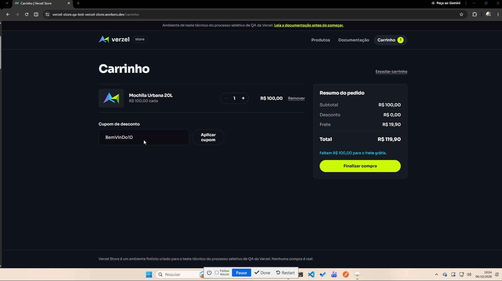
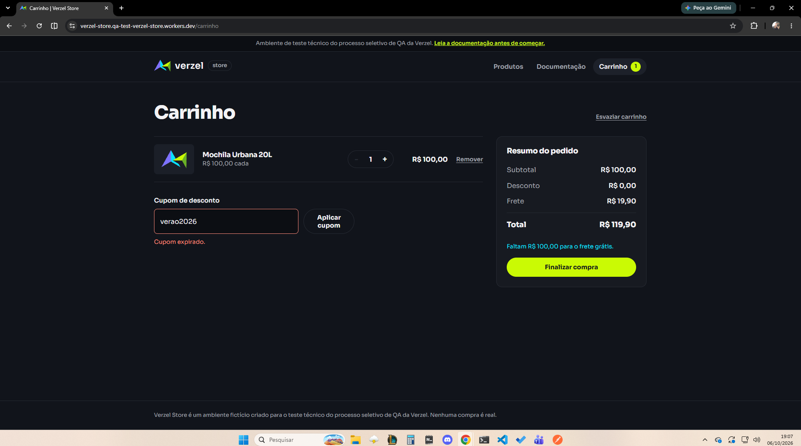

# 📸 Evidências de Execução dos Testes Manuais - Verzel Store

## 🎟️ Cenários de Cupons de Desconto

### Cenário 1: Aplicação de cupom válido com sucesso
* **Status:** Passou ✅

<b>🔍 Clique para expandir a evidência do Cenário 1</b>

---

### Cenário 2: Aplicação de cupom com letras minúsculas e espaços
* **Status:** Passou ✅

<b>🔍 Clique para expandir a evidência do Cenário 2</b>

---

### Cenário 3: Tentativa de aplicação de cupom inexistente
* **Status:** Passou ✅

<b>🔍 Clique para expandir a evidência do Cenário 3</b>

---

### Cenário 4: Tentativa de aplicação de cupom expirado
* **Status:** Passou ✅

<b>🔍 Clique para expandir a evidência do Cenário 4</b>

---

### Cenário 5: Remoção do cupom aplicado no carrinho
* **Status:** Passou ✅

<b>🔍 Clique para expandir a evidência do Cenário 5</b>

